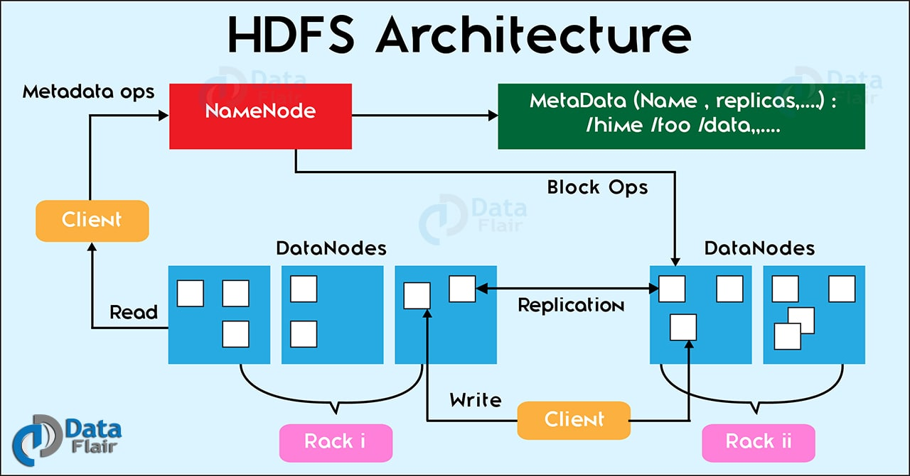
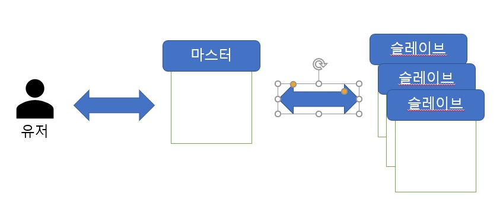
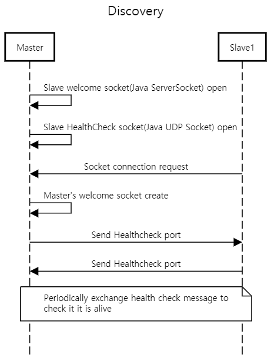

# 미니 하둡

분산 클라우드 스토리지 서버

마스터 노드와 슬레이브 노드로 데이터를 총 세 군데에 저장하여 reliability를 증가시킨 하둡과 비슷한 형태의 분산 클라우드 스토리지 서버를 작성하였다.

## Prerequisite

* Windows 10
* JDK 8 이상
* Protobuf [optional]

## 빌드

`gradle` 빌드시스템을 사용한다. 추가로 설치할 필요 없이 `.\gradlew`을 실행하면 필요한 파일들을 알아서 설치하고 실행할 수 있게 해준다.

```bash
# (windows) powershell or cmd, tested on only Windows
# in project root
.\gradlew runProtoc # optional, 이미 실행되어 있음
.\gradlew jar
```

### protoc에서 에러가 나는 경우

`.\gradlew runProtoc`을 실행할 때 에러가 발생하는 경우 [Protobuf](https://github.com/protocolbuffers/protobuf/releases)를 설치한 후 PATH에 등록한 후 프로젝트 루트에서 다음과 같이 실행하면 된다.

```powershell
protoc.exe --java_out=.\src\main\java .\src\main\proto\*.proto
```

## 실행

## 서버 실행

```powershell 
# powershell
Set-Location .\script
# cd .\script in cmd
# lauhcn in differenc session
.\run-master.ps1 # for launch master
.\run-slave.ps1  # for launch slave
.\run-slave2.ps1 # for launch slave
.\run-slave3.ps1 # for launch slave
# 설정파일을 새로 만들고 포트 번호만 
# 충돌되지 않게 하면 3개 이상도 가능하다.
```

### 클라이언트 접속

```powershell
.\run-client.ps1 # for launch client
# or in project root
java -cp .\build\libs\minihadoop-1.0-SNAPSHOT-all.jar comnet.minihadoop.client.Application -p [opening port] -m [master address/hostname]:[port]
```

```bash
# defined in /config/user.yaml
Enter ID: root 
Enter password: 1234
```

아이디와 비밀번호를 입력하면 프롬프트에 진입할 수 있다.

```powershell
root >>
```

아래 명령어를 이용하면 파일을 업로드 할 수 있다.

```powershell
root >> upload [filename]
```

잘 전송되었는지 확인하려면 `ls` 명령어를 사용한다.

```powershell
root >> ls

Filename            |      File Size
--------------------|---------------
gradlew             |              0
gradlew.bat         |           2941
test                |      170460680
```

## 설정

`/config` 디렉토리에 설정파일들이 있다. 포트 충돌이 나거나 주소를 변경해야될 때는 컴파일 다시할 필요 없이 설정 파일만 수정하면 정상적으로 실행가능하다. 첫 연결시 타임아웃 시간 설정, 데이터를 저장할 디렉토리 설정 등도 할 수 있다.

아이디와 비밀번호는 `/config/user.yaml`을 통해 추가할 수 있다.

## Architecture

### HDFS Architecture



* Namenode: 마스터 노드로 파일의 위치, Data node(슬레이브 노드)를 관리한다.
* Data noe: 슬레이브 노드로, 마스터 노드로부터 client의 명령을 받고(block ops), Read/Write가 필요할 때는 클라이언트와 직접 통신한다.

### 미니 하둡 architecture



* 유저
  * 마스터를 통해 파일 업로드 및 쿼리 가능
* 마스터노드
  * 유저 인증
  * 클라이언트 세션 관리
  * 슬레이브 노드의 auto discovery
  * 주기적으로 슬레이브 노드들과 통신하며 슬레이브 노드가 살아있음을 확인(Health Check)
* 슬레이브노드
  * 유저가 업로드한 파일을 저장
  * 주기적으로 마스터노드와 통신하며 마스터 노드가 살아있음을 확인(Health Check)

## 시나리오

### 업로드 시나리오

1. 유저가 클라이언트를 실행하여 아이디와 비밀번호를 입력한다.
2. 프롬프트에 진입하면  `upload [filename]` 를 실행해 파일을 업로드한다.
3. 마스터노드에서는 슬레이브 노드의 용량을 체크해 가장 작은 3 개의 슬레이브 노드를 선택한다.
4. 선택된 슬레이브 중 한 슬레이브에 파일을 전송한다.
5. 파일을 전송받은 슬레이브가 다른 2개의 노드에 파일을 replicate한다.


### Discovery & Health check



## 구현 상세

* Auto-Discovery
  * 마스터와 슬레이브가 연결되면 서로 UDP를 통해 Health Check 메시지를 주기적으로 주고 받는다. 주기는 설정파일에서 정할 수 있다. 마스터가 어떤 슬레이브로부터 일정 기간 동안 헬스체크 메시지를 받지 못했다면 해당 슬레이브 서버가 다운된 것으로 간주하고 사용하지 않는다.
  * 같은 방법으로 일정기간동안 슬레이브가 마스터로부터 메시지를 받지 못하면 마스터가 다운된 것으로 간주하고 종료한다.
  * 클라이언트는 계속 TCP로 통신하고 있으므로 마스터가 TCP 소켓을 통해 헬스체크 메시지를 이상없이 보낸다면 클라이언트가 살아있는 것으로 간주한다.
  
* 클라이언트가 보낸 요청마다 스레드를 생성해 최대한 비동기적으로 작동할 수 있도록 하였다. 여러 유저가 접근해서 이용하는 것도 가능하며, 같은 ID로 여러 세션에서 로그인해 작업하는 것도 가능하가다.

* 여러 스레드가 공유하는 객체에 데이터 레이스가 발생하지 않도록 `synchronized`를 이용했고 데드락이 발생하지 않도록 lock 순서를 정해 locking hierarchy를 따르도록 하였다.

* 업로드 과정
  * 클라이언트가 파일 크기를 마스터에게 보낸다.
  * 마스터는 파일 크기에 따라 3 개의 슬레이브 노드(연결된 슬레이브가 3개 적으면 적게 선택된다.)
    * 슬레이브가 연결되지 않은 경우 클라이언트의 요청이 거절된다.
  * 마스터는 클라이언트에게 ACK를 보낸다.
  * 클라이언트는 `ServerSocket`의 주소와 포트 번호를 마스터에게 보낸다.
  * 마스터는 한 슬레이브 서버(이하 서버1)를 선택해 클라이언트의 `ServerSocket`의 주소솨 포트 번호를 보낸다.
  * 서버 1은 클라이언트의 `ServerSocket`에 연결하고 파일을 전송한다.
  * 서버 1은 마스터에게 파일 전송이 정상적으로 완료되었음을 알린다. 아래 작업들은 별도의 스레드에서 진행되므로 이 시점에서 클라이언트는 다른 작업을 할 수 있다. 
  * 마스터는 파일을 받지 않은 2개 슬레이브 서버(이하 서버2)에 Replication 요청을 보낸다.
  * 서버 2는 Replication 요청에 반응해서 자신의 `ServerSocket`의 주소와 포트 번호를 마스터에게 보낸다. 마스터는 서버 1에 이 정보를 그대로 보내 서버 1이 서버 2이 연결될 수 있도록 한다. replication하는 서버가 2개이므로 서로 다른 스레드에서 작동한다.
  * 파일 전송이 완료되면 마스터에게 완료되었음을 알린다.
  
* Protobuf

  * 서로 다른 종류의 메시지를 클래스로 일일히 구현하는 것이 어려움도 있고 Serialization 문제도 있어서 Protocol Buffer를 이용하였다.

  * 예를 들어 Protocol Buffer로 작성하면 Language-Independent하게 메시지 클래스를 작성할 수 있다.

    ```protobuf
    // test.proto
    message Request {
    	enum Status{
    		SUCCESS=0;
    		FAIL=1;
    	}
    	Status status;
    	int32 port;
    	string address;
    }
    ```

    `run protoc --java_out ./ ./test.proto`을 실행하면 `Test.java`를 생성해준다.

    ```java
    // Generated by the protocol buffer compiler.  DO NOT EDIT!
    // source: test.proto
    
    public final class Test {
      /**
       * Protobuf type {@code Request}
       */
      public  static final class Request extends
          com.google.protobuf.GeneratedMessageV3 implements
          // @@protoc_insertion_point(message_implements:Request)
          RequestOrBuilder {
      private static final long serialVersionUID = 0L;
        // Use Request.newBuilder() to construct.
        private Request(com.google.protobuf.GeneratedMessageV3.Builder<?> builder) {
          super(builder);
        }
        private Request() {
          status_ = 0;
          address_ = "";
        }
        @java.lang.Override
        public Builder newBuilderForType() { return newBuilder(); }
        public static Builder newBuilder() {
          return DEFAULT_INSTANCE.toBuilder();
        }
    	/*... */
    }
    ```

    protobuf를 이용하면 다른 언어로 구현 어플리케이션과도 소켓 통신을 쉽게 할 수 있다.

## 구현되지 않은 것

1. 다운로드 기능
   1. 업로드 기능과 거의 동일하게 구현이 가능한데 시간 부족으로 구현까지는 하지 못했다.
2. 보안/ 암호화
   1. 유저 인증도 단순히 해시값의 비교일 뿐 보안 기능을 한다고 보기는 어렵다.
3. 파일시스템
   1. 업로드한 파일들을 디렉토리 형태로 관리할 수 있도록 파일시스템을 구현하려고 했으나 네트워크 기능에 더 집중하기 위해 생략하였다.
4. Data Persistency
   1. 슬레이브가 종료되면 저장했던 파일에 대한 정보는 유지하지 않는다.
5. standby 마스터 서버
   1. 마스터 서버가 다운되면 모든 서버다 다운되므로 마스터 서버를 2개 두고 하나는 standby 시킨다. 한 마스터 서버가 죽으면 standby된 마스터 서버가 바로 이어서 작업을 진행한다.